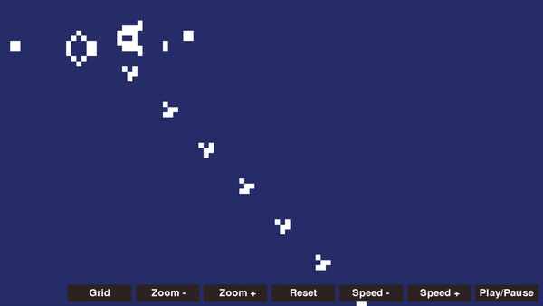

# Conway's game of life

Just a simple implementation of Conway's game of life done in python.

To run the program: ```python3 life.py```
(pygame is needed)


Things to implement/improve :
- a way to save cells
- a way to load cells
- improve the overall UI



